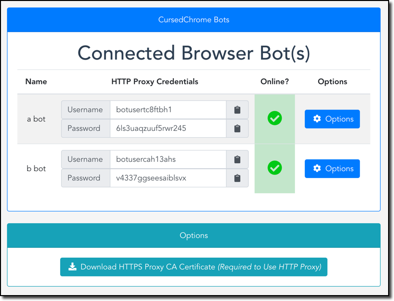
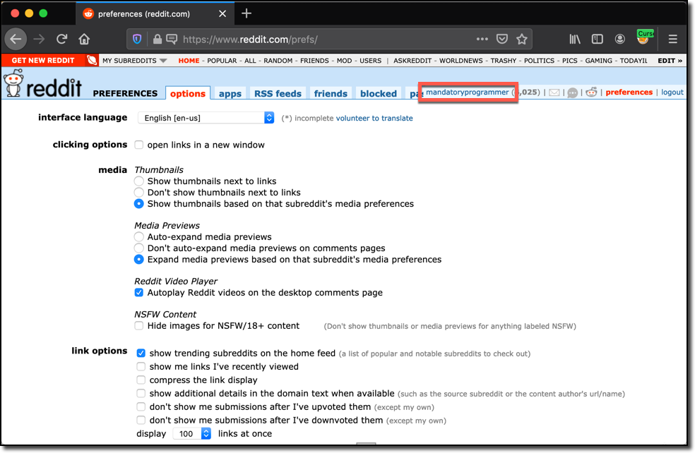
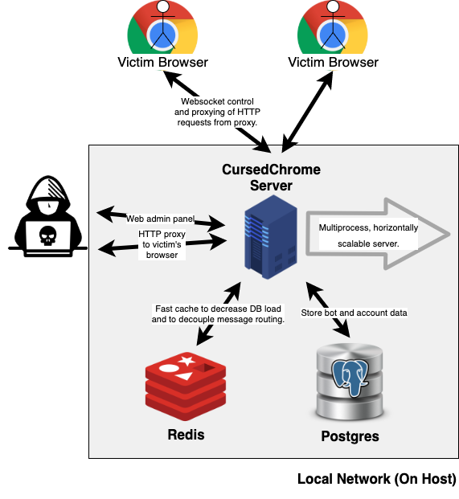

# CursedChrome

<p align="center">
	
</p>

## What is it?
A ([cursed](https://knowyourmeme.com/memes/cursed-image)) Chrome-extension implant that turns victim Chrome browsers into fully-functional HTTP proxies. By using the proxies this tool creates you can browse the web authenticated as your victim for all of their websites.

More and more companies are moving toward the ["BeyondCorp"](https://en.wikipedia.org/wiki/BeyondCorp) model (e.g. no flat internal network, zero trust everything). This is usually implemented via a [reverse proxy/OAuth wall](https://github.com/bitly/oauth2_proxy) gating access to services, eliminating the need for a VPN. With more and more access becoming strictly available via the web browser, having a way to easily hijack and use victim's web sessions becomes an ever increasing necessity.

This is especially useful for locked down orgs that make use of [Chrome OS](https://en.wikipedia.org/wiki/Chrome_OS) where traditional malware can't be used at all. It's also steathy, as all requests will have the appropriate source-IP, cookies, client-certificates, etc since it's being proxying directly through the victim's browser.

## Screenshots

### Web Admin Panel


### Browsing Websites Logged In as Victim (using Firefox with HTTP Proxy)


## (Rough) Infrastructure Diagram (`docker-compose` Used)



### Ports & Listening Interfaces

- `127.0.0.1:8080`: HTTP proxy server (using one of the credentials in the admin panel, you can auth to a specific victim's Chrome browser via this HTTP proxy server). You also need to install the generated CA available via the admin panel before using this.
- `127.0.0.1:4343`: Websocket server, used for communicating with victim Chrome instances to transfer HTTP requests for proxying and sending commands.
- `127.0.0.1:8118`: Admin web panel for viewing victim Chrome instances and getting HTTP proxy credentials.


## Requirements

* [`docker`](https://docs.docker.com/get-docker/) and [`docker-compose`](https://docs.docker.com/compose/install/)
* Chrome web browser

## Setting Up the Backend

The backend is entirely dockerized and can be setup by running the following commands:

```
cd cursedchrome/
# Start up redis and Postgres containers in the background
docker-compose up -d redis db
# Start the CursedChrome backend
docker-compose up cursedchrome
```

Once you start up the backend you'll see an admin username and password printed to the console. You can log into the admin panel at `http://localhost:8118` using these credentials (you will be prompted to change your password upon logging in since the one printed to the console is likely logged). 

## Installing the CursedChrome CA for Proxying HTTPS

Once you have the backend setup, log in to the admin panel at `http://localhost:8118` (see above) and click the `Download HTTPS Proxy CA Certificate` button. This will download the generated CA file which is required in order to proxy HTTPS requests.

You will need to install this CA into your root store, the following are instructions for various OS/browsers:

* [OS X/Mac](https://www.sslsupportdesk.com/how-to-import-a-certificate-into-mac-os/)
* [Windows](https://www.sslsupportdesk.com/how-to-enable-or-disable-all-puposes-of-root-certificates-in-mmc/)
* [Linux](https://thomas-leister.de/en/how-to-import-ca-root-certificate/)
* [Firefox (any OS)](https://support.securly.com/hc/en-us/articles/360008547993-How-to-Install-Securly-s-SSL-Certificate-in-Firefox-on-Windows)

## Setting Up the Example Chrome Extension Implant

To install the example chrome extension implant, do the following:

* Open up a Chrome web browser and navigate to `chrome://extensions`.
* Click the toggle in the top-right corner of the page labeled `Developer mode` to enable it.
* Click the `Load unpacked` button in the top-left corner of the page.
* Open the `extension/` folder inside of this repo folder.
* Once you've done so, the extension will be installed.

*Note:* You can debug the implant by clicking on the `background page` link for the text `Inspect views background page` under the `CursedChrome Implant` extension.

After you've install the extension it will show up on the admin control panel at `http://localhost:8118`.

## Modifying Implant Extension

An example implant extension has been included under the `extension/` folder. This extension has the `extension/src/bg/background.js` file which has the extension-side of the implant that connects to the service via WebSocket to proxy requests through the victim's web browser.

The following [extension permissions](https://developer.chrome.com/extensions/api_index) are needed by the implant to operate:

```
"permissions": [
	"webRequest",
	"webRequestBlocking",
	"<all_urls>"
]
```

This code contains comments on how to modify it for a production setup. Basically doing the following:

* Minifying/stripping/uglifying the JavaScript code
* Modifying the WebSocket connection URI in the `initialize()` function to point to the host you've set up the backend on. By default it's set to `ws://localhost:4343` which will work with the out-of-the-box dev setup described in this README. 

In a real world attack, this extension code would be used in one of the following ways:

* Injected into an existing extension with proper permissions via Chrome debugging protocol.
* Hidden inside of another extension
* Force-installed via Chrome enterprise policy

These topics are outside of the scope of this README, but eventually will be covered separately.

## Notes on Production Deployments

* You will likely want to run an Nginx server with a valid HTTPS certificate doing a `proxy_pass` to the WebSocket server (running on `127.0.0.1:4343`). Then you'll have TLS-encrypted websocket traffic.
* For a more secure setup, don't expose the HTTP proxy & and admin panel to the Internet directly. Opt for SSL port-forwarding or using a bastion server to connect to it.
* For situations with a large number of victims/bots/implants running, you can horizontally scale out the CursedChrome server as wide as you need to. The socket handling is completely decoupled via `redis`, so it can suppose (theoretically) tens of thousands of concurrent clients. 

## Attributions

* The icon used for the web panel favicon and the example Chrome implant extension is provided by Freepik from `www.flaticon.com`.
* The [AnyProxy source code](https://github.com/alibaba/anyproxy) was heavily modified and used for part of this project.